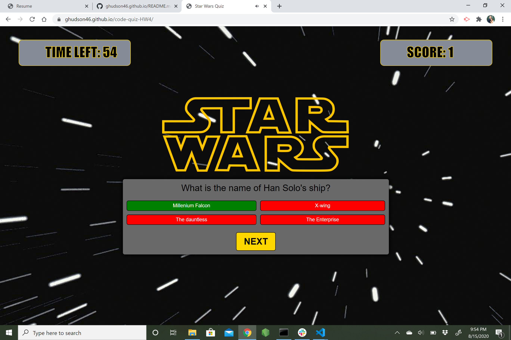
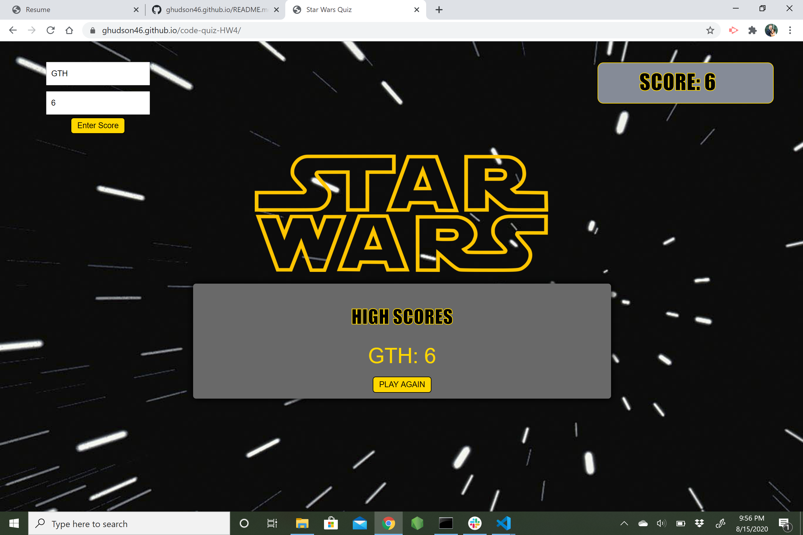

# code-quiz-HW4
This is a project that uses javascript and jQuery to create a quiz testing the user on their Star Wars knowledge. The user will have a timer that will start when they start the quiz. Each answer will be logged and marked correct or incorrect. If the answer is incorrect, the user is penalized time. After each question the site will move forward to the next question

# functionality
This application will be able to store the users final score in the local browser storage and show them their highest scores from best to worst. This app lets the user see if they got a question right or wrong, takes 5 seconds off the timer for a wrong answer and gives them 1 point for a correct answer. I added sound fx to correlate with the start of the game, correct and incorrect answers, and changing questions.

# Technology used
HTML
CSS
javascript

# Images
Landing Page 
Gameplay 
High Score 

# links

https://github.com/ghudson46/code-quiz-HW4

https://ghudson46.github.io/code-quiz-HW4/

# license 

[MIT](https://choosealicense.com/licenses/mit/)

# contact info
email: garrett.hudson46@gmail.com
phone: (919) 606-6599